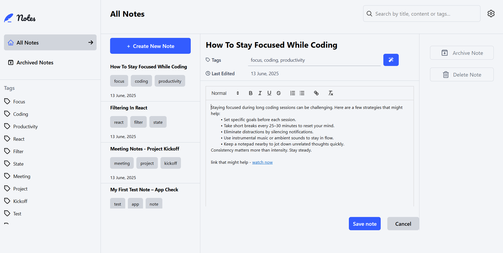

# 📝 Full-Stack Note-Taking App (MERN)

This is a full-stack note-taking app built with the **MERN stack** (MongoDB, Express.js, React, and Node.js). Users can create, read, update, delete, archive, and search notes—with support for themes, keyboard navigation, and responsive design.

## Preview

## 

## 🚀 Features (Frontend)

- ✅ Create, read, update, and delete notes
- 📦 Archive and unarchive notes
- 🧾 View all notes or archived notes
- 🔍 Search notes by title, tag, or content
- 🏷️ Filter notes by specific tags
- 🎨 Select preferred **color** and **font** themes
- ⚠️ Receive validation messages if required fields are missing
- ⌨️ Full keyboard navigation support
- 📱 Responsive layout across devices
- 💡 Hover and focus states for all interactive elements
> ✨ Auto-tagging is powered by title analysis logic from the backend  
> 🤖 Built with help from **Gemini AI**

### 🔐 Bonus (Full-Stack):

- 🗃️ All notes are saved to a database (MongoDB)
- 👤 Create an account, log in, change password
- 🔁 Reset your password if forgotten

---

## Getting Started

### Prerequisites

- Node.js
- MongoDB
- npm 

### Installation

1. Clone the repository:

```bash
git clone https://github.com/4002-Nonye/Note-Taking-Web-App.git
cd server
```

2. Install dependencies for both frontend and backend:

```bash
# Backend
cd server
npm install

# Frontend
cd /client
npm install
```

3. Set up your environment variables (`/server/config/dev` ).

4. Run the app:

```bash
# Backend
cd server
npm run dev
```

## 🔧 Backend API Documentation

All API routes (except login and registration) are **protected** and require authentication via the `requireLogin` middleware.


### 🧑‍💼 Authentication

#### `POST /api/register`
- **Description:** Register a new user
- **Request Body:**
  ```json
  {
    "email": "user@example.com",
    "password": "securePassword"
  }
````

- **Response:** Registered user or error

#### `POST /api/login`

- **Description:** Login an existing user
- **Request Body:**
  ```json
  {
    "email": "user@example.com",
    "password": "securePassword"
  }
  ```
- **Response:** Authenticated user or error

---

### 🗒️ Notes

#### `GET /api/notes`

- **Description:** Fetch all notes for the logged-in user
- **Query:** None
- **Response:** List of notes

#### `GET /api/note/:id`

- **Description:** Fetch a specific note by its ID
- **Response:** Note object or error

#### `POST /api/new-note`

- **Description:** Create a new note
- **Request Body:**
  ```json
  {
    "title": "My Note",
    "content": "This is a note.",
    "tags": ["react", "mongodb"],
    "archive": false
  }
  ```
- **Response:** Created note

#### `PUT /api/note/edit/:id`

- **Description:** Update a note by ID
- **Request Body:** Any of the following fields:
  ```json
  {
    "title": "Updated",
    "content": "New content",
    "tags": ["tag1"],
    "archive": true,
    "lastEdited": "ISODate"
  }
  ```

#### `DELETE /api/note/del/:id`

- **Description:** Delete a note permanently

---

### 📁 Archive

#### `GET /api/notes/archive`

- **Description:** Fetch all archived notes

---

### ⚙️ User Settings

#### `PUT /api/account/settings`

- **Description:** Update user preferences
- **Request Body:**
  ```json
  {
    "fontTheme": "serif",
    "colorTheme": "dark"
  }
  ```

---

### 🔒 Password Management

#### `PUT /api/account/passwordchange`

- **Description:** Change user password
- **Request Body:**
  ```json
  {
    "oldPassword": "current",
    "newPassword": "newStrongPassword"
  }
  ```

> 🔐 Note: This will fail if the user registered using Google.

---

## 🗂️ Project Structure

```
project-root/
│
├── client/          # React frontend
├── server/          # Node/Express backend
├── README.md        # You're here
└── ...
```

---

## 📦 Tech Stack

- **Frontend:** React + Tailwind CSS  
- **State Management:** TanStack Query (React Query) + Context API  
- **Backend:** Express.js + MongoDB 
- **Auth:** JWT-based authentication   
- **Validation/Security:** Express middleware, XSS sanitization  
- **Deployment:** Render  
---

